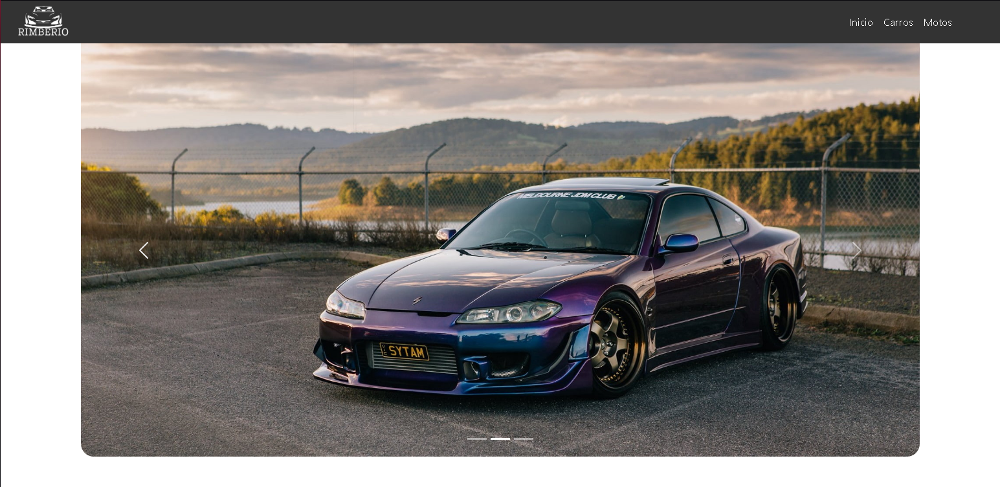
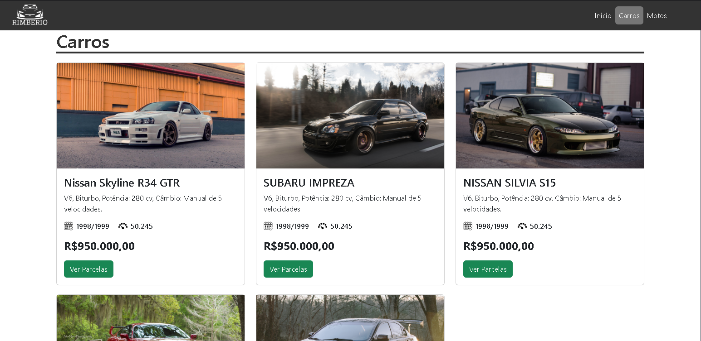
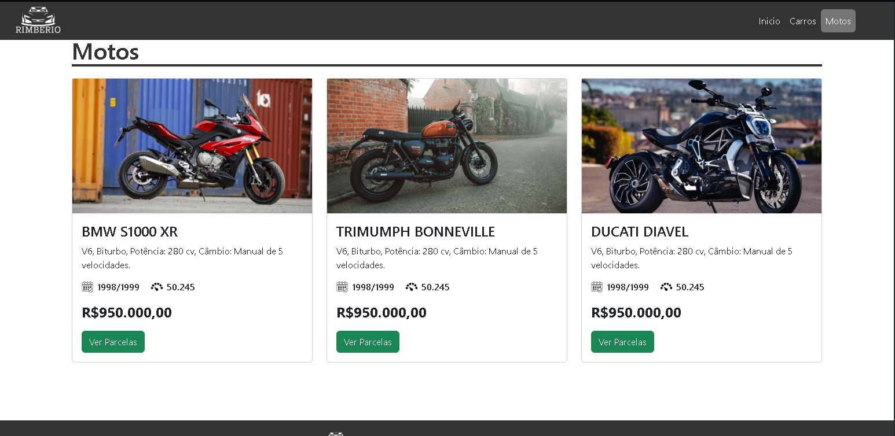

## 🚗 Site Concessionária - Página Inicial

[🇺🇸 English Version](READM.md) | [🇧🇷 Versão em Português](PT-BR-README.md)

---



Uma landing page institucional para uma concessionária de veículos, desenvolvida como exercício prático utilizando **HTML5** e **CSS3**.

## 📋 Índice

- [📌 Sobre o Projeto](#-sobre-o-projeto)
- [🚀 Tecnologias Utilizadas](#-tecnologias-utilizadas)
- [💻 Como Executar](#-como-executar)
- [📷 Imagens e Layout](#-imagens-e-layout)
- [📬 Contato](#-contato)
- [📜 Licença](#-licença)

---

## 📌 Sobre o Projeto

O **Site Concessionária** é um projeto de site estático para uma loja fictícia de veículos. A página apresenta uma estrutura limpa, organizada e moderna, simulando uma loja com catálogo de carros, área institucional e formas de contato.

## 🔹 Recursos principais

✅ Design moderno e responsivo  
✅ Organização por seções (catálogo, contato, etc.)  
✅ Layout intuitivo e navegável  
✅ Estilo adaptado para prática profissional

---

## 🚀 Tecnologias Utilizadas

Este projeto foi construído utilizando:

- **HTML5**
- **CSS3**

---

## 💻 Como Executar

1️⃣ Clone o repositório:  
```bash
git clone https://github.com/zSayloon/Site-Concession-ria.git
```
2️⃣ Acesse a pasta do projeto:
```bash
cd Site-Concession-ria
```
3️⃣ Abra o arquivo index.html no seu navegador.

> 💡 Dica: Use a extensão Live Server no VSCode para uma experiência em tempo real durante o desenvolvimento.

## 📷 Imagens e Layout

Abaixo estão algumas capturas de tela do site em funcionamento:

<p align="center">
  
</p>

<p align="center">
  
</p>

<p align="center">
  
</p>

--- 

## 📬 Contato

📧 **Email:** eduardo.f5@outlook.com
🔗 **LinkedIn:** [Eduardo Falabriti](https://www.linkedin.com/in/eduardo-falabriti-b-ferreira-537241310/)

---

## 📜 Licença
Este projeto foi desenvolvido com fins educacionais e não possui fins comerciais.

---
 
🕹️ **Desenvolvido como prática de HTML e CSS por Eduardo Falabriti**
