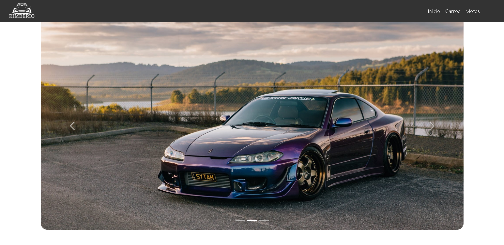
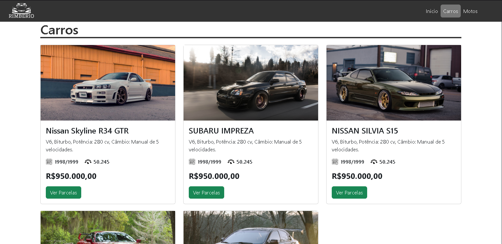

## 🚗 Car Dealership Website - Landing Page

[🇧🇷 Versão em Português](README.md) | [🇺🇸 English Version](#)

---



A responsive and clean landing page for a fictional car dealership, developed as a practical exercise using **HTML5** and **CSS3**.

## 📋 Table of Contents

- [📌 About the Project](#-about-the-project)
- [🚀 Technologies Used](#-technologies-used)
- [💻 How to Run](#-how-to-run)
- [📷 Screenshots](#-screenshots)
- [📬 Contact](#-contact)
- [📜 License](#-license)

---

## 📌 About the Project

The **Car Dealership Website** is a static web project designed for a fictional vehicle store. It features a clean, organized, and modern layout simulating a professional car sales website, including vehicle listings, company info, and contact options.

## 🔹 Main Features

✅ Modern and responsive design  
✅ Well-structured sections (catalog, contact, etc.)  
✅ Simple and intuitive layout  
✅ Ideal for HTML/CSS practice and portfolio use

---

## 🚀 Technologies Used

This project was built using:

- **HTML5**  
- **CSS3**

---

## 💻 How to Run

1️⃣ Clone the repository:  
```bash
git clone https://github.com/zSayloon/Site-Concession-ria.git
```

2️⃣ Navigate into the project folder:  
```bash
cd Site-Concession-ria
```

3️⃣ Open the `index.html` file in your browser.

> 💡 Tip: Use the **Live Server** extension in VSCode to preview changes in real time during development.

---

## 📷 Screenshots

Below are some screenshots of the site in action:

<p align="center">
  
</p>

<p align="center">
  
</p>

<p align="center">
  
</p>

---

## 📬 Contact

📧 **Email:** eduardo.f5@outlook.com  
🔗 **LinkedIn:** [Eduardo Falabriti](https://www.linkedin.com/in/eduardo-falabriti-b-ferreira-537241310/)

---

## 📜 License

This project was created for educational purposes only and has no commercial license.

---

🕹️ **Developed as an HTML & CSS practice project by Eduardo Falabriti**
